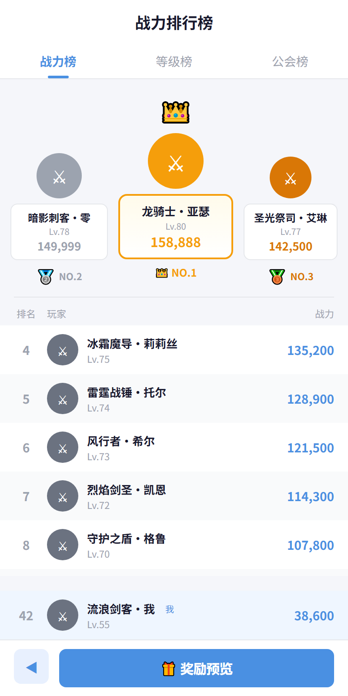

# pug-cli

独立可执行的 [Pug](https://pugjs.org/) 模板引擎 CLI 工具，并扩展了 HTML→SVG/PNG 渲染与 HTML→Pug 反向转换能力。

## 功能概览

| 功能 | 说明 |
|------|------|
| **Pug → HTML** | 标准 Pug 模板编译，支持所有原生选项（pretty、doctype、locals、filters、plugins 等） |
| **Pug → JS** | 编译为客户端 JavaScript 函数（`pug.compileClient`） |
| **HTML/XML → Pug** | 反向转换，自动识别 HTML 模式（`#id`、`.class` 简写）与 XML 模式（保留命名空间、CDATA） |
| **HTML → SVG** | 通过 Vercel Satori 引擎渲染为 SVG，支持 Flexbox CSS、Emoji |
| **HTML → PNG** | 通过 Playwright 无头 Chromium 渲染为 PNG，支持 Retina、裁剪、全页截图 |
| **Pug → PNG** | 一步到位：Pug → HTML → PNG |
| **MCP Server** | 作为 Model Context Protocol 服务器运行，供 AI 编程助手直接调用 |
| **Watch 模式** | 监听文件变化自动重编译 |
| **Stdin 模式** | 从标准输入读取模板 |
| **SEA 可执行文件** | 可构建为 Node.js 单文件可执行程序（无需 Node.js 运行时） |

## 安装

```bash
# 从源码安装（开发模式）
npm install

# 构建打包版本（可选）
npm run build
```

`npm run build` 会生成：
- `dist/pug-cli-bundled.js` — esbuild 打包的单文件 JS（可脱离 node_modules 运行，但仍需 Node.js）
- `dist/pug-cli.exe` — Node.js SEA 独立可执行文件（无需安装 Node.js）

## 快速上手

```bash
# Pug → HTML
node src/cli.js input.pug -o output/

# 美化输出
node src/cli.js input.pug -o output/ --pretty

# 传递模板变量
node src/cli.js input.pug -o output/ -O '{"title":"Hello"}'

# HTML → Pug 反向转换
node src/cli.js page.html -o output/ --reverse

# Pug → SVG 渲染
node src/cli.js card.pug -o output/ --to-svg --width 400 --height 200

# Pug → PNG 截图（需要系统安装 Chrome/Edge/Chromium）
node src/cli.js card.pug -o output/ --to-png --width 400 --height 200

# 生成配置文件模板
node src/cli.js --config-gen

# 启动 MCP 服务器
node src/cli.js --mcp-server
```

## 效果展示

以下示例将 Pug 模板（含变量、mixin、循环、条件、CSS 类）一步渲染为 PNG 截图：

<table>
<tr>
<th width="55%">源码（节选）</th>
<th width="45%">渲染输出</th>
</tr>
<tr>
<td>

```pug
//- ═══ 数据变量 ═══
- var rankTitle = "战力排行榜"
- var tabs = ["战力榜", "等级榜", "公会榜"]
- var top3 = [
    { name: "龙骑士·亚瑟", level: 80, score: 158888 },
    { name: "暗影刺客·零", level: 78, score: 149999 },
    { name: "圣光祭司·艾琳", level: 77, score: 142500 }
  ]
- var rankList = [
    { rank: 4, name: "冰霜魔导·莉莉丝", level: 75, score: 135200 },
    { rank: 5, name: "雷霆战锤·托尔", level: 74, score: 128900 }
  ]

//- ═══ Mixin：排名徽章 ═══
mixin rankBadge(rank)
  if rank <= 3
    span 🥇 NO.#{rank}
  else
    span.text-tertiary #{rank}

//- ═══ Mixin：排行行 ═══
mixin rankRow(rank, name, level, score, isMe)
  div(style="display:flex; align-items:center; padding:10px 16px")
    +rankBadge(rank)
    div(style="flex:1")
      span #{name}
      if isMe
        span.tag 我
    span #{score.toLocaleString()}

//- ═══ Tab 切换栏 ═══
nav.nav-bg
  each tab, i in tabs
    div(class=(i===0 ? 'nav-active' : 'nav-inactive')) #{tab}

//- ═══ 循环渲染排名 ═══
each item in rankList
  +rankRow(item.rank, item.name, item.level, item.score, false)
```

</td>
<td>



</td>
</tr>
</table>

> 💡 完整源码：[tests/input/rank-view.pug](tests/input/rank-view.pug) — 包含 CSS 设计系统、Top 3 领奖台、底部固定栏等更多特性。

## 文档

- **[CLI 使用手册](docs/cli-manual.md)** — 所有 CLI 命令、参数及行为详解
- **[MCP 使用手册](docs/mcp-manual.md)** — MCP 模式的 6 个工具及其参数说明

## 依赖

- **pug** — Pug 模板引擎（核心编译）
- **@modelcontextprotocol/sdk** — MCP 协议支持
- **satori** + **satori-html** — HTML→SVG 渲染（Flexbox CSS）
- **playwright-core** — HTML→PNG 渲染
- **htmlparser2** — HTML→Pug 反向转换

## 配置文件

运行 `pug-cli --config-gen` 在当前目录生成 `pug-cli.config.json` 模板。支持的自定义项包括浏览器搜索路径、启动参数、默认尺寸与缩放、PNG 包装 CSS。

配置查找顺序（先找到的生效）：
1. `./pug-cli.config.json`（项目级）
2. `~/.pug-cli/config.json`（用户级）

## License

MIT
